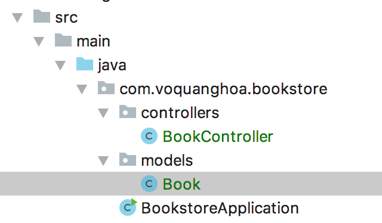
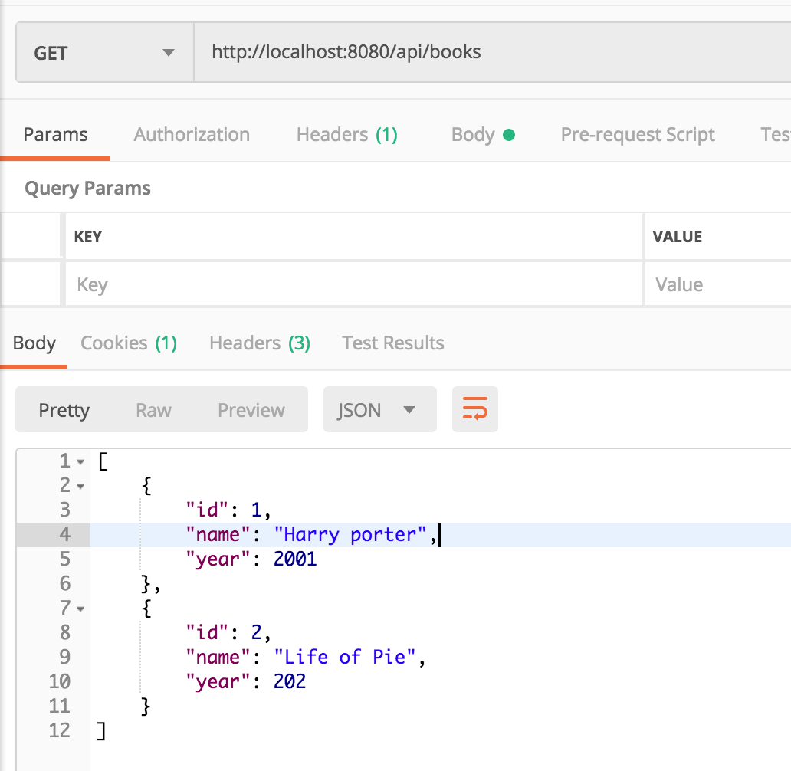

Controller là nơi chứa phần xử lý các request được gửi lên từ phía người dùng. 

## Tạo controller

Dưới đây ta sẽ tạo một controller theo chuẩn kiểu Restful mặc dù không có tương tác thực sự với database.

Tạo một class `Book` trong package `models` và một class `BookController` trong package `controllers` như sau:



Nội dung class `Book`

```java
public class Book {

    private int id;

    private String name;

    private int year;

    public int getId() {
        return id;
    }

    public void setId(int id) {
        this.id = id;
    }

    public String getName() {
        return name;
    }

    public void setName(String name) {
        this.name = name;
    }

    public int getYear() {
        return year;
    }

    public void setYear(int year) {
        this.year = year;
    }

    @Override
    public String toString() {
        return String.format("[Book %d year %d name %s]", id, year, name);
    }
}
```

Nội dung file BookController

```java
import com.voquanghoa.bookstore.models.Book;
import org.springframework.web.bind.annotation.*;

@RestController
@RequestMapping("/api/books")
public class BookController {

    @GetMapping("/{id}")
    Book get(@PathVariable int id){
        Book book = new Book();
        book.setId(id);
        book.setName("Harry porter");
        book.setYear(2001);

        return book;
    }

    @GetMapping
    Book[] get(){
        Book book1 = new Book();
        book1.setId(1);
        book1.setName("Harry porter");
        book1.setYear(2001);

        Book book2 = new Book();
        book2.setId(2);
        book2.setName("Life of Pie");
        book2.setYear(202);

        return new Book[]{book1, book2};
    }

    @DeleteMapping("/{id}")
    void delete(@PathVariable int id){
        System.out.println("Delete book id " + id);
    }

    @PostMapping()
    void post(@RequestBody Book book){
        System.out.println("Create book " + book);
    }


    @PutMapping()
    void put(@RequestBody Book book){
        System.out.println("Update book " + book);
    }
}
```

Chạy dịch vụ web, dùng Postman để test, kết quả nhận được



Đối với các request như POST, DELETE, PUT mặc dù không có kết quả trả về nhưng ta cũng có thể xem log


## Câu hỏi tự nghiên cứu và bài tập

1. Annontation trong java là gì

2. Làm tài liệu các enpoint trong controller trên với (url, method, params, postbody)

3. Các java annotation sau đây có tác dụng gì và cách sử dụng
- @RestController
- @RequestMapping
- @GetMapping
- @PutMapping
- @PostMapping
- @DeleteMapping
- @PathVariable
- @RequestBody

4. Viết controller tương tự cho `Category`, `Author`


