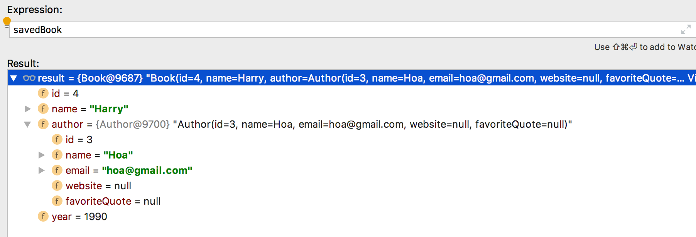
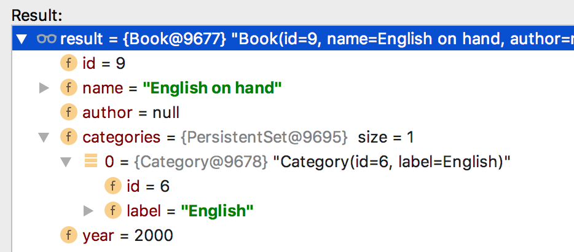

# Database phần 3 - Các dữ liệu quan hệ

Xem

- [Cài đặt, sử dụng nhanh](Database-1.md)
- [Tùy biến, Query](Database-2.md)

## Quan hệ Nhiều - Một

Giả sử ta có lớp `Book` và lớp `Author` và ta có mối quan hệ `Nhiều book` thuộc về `Một Author`, khi đó ta thiết lập mối quan hệ `@ManyToOne` từ lớp `Book` tới lớp `Author`.

Lớp `Book`

```java
import lombok.Data;

import javax.persistence.*;

@Data
@Entity
public class Book {

    @Id
    @GeneratedValue(strategy= GenerationType.AUTO)
    private int id;

    private String name;

    @ManyToOne
    private Author author;

    private int year;
}
```

Lớp `Author`

```java
import lombok.Data;

import javax.persistence.Entity;
import javax.persistence.GeneratedValue;
import javax.persistence.GenerationType;
import javax.persistence.Id;

@Entity
@Data
public class Author {

    @Id
    @GeneratedValue(strategy = GenerationType.AUTO)
    private int id;

    private String name;
    private String email;
    private String website;
    private String favoriteQuote;
}
```

Thử nghiệm

```java
System.out.println("Hello World");
Author author = new Author();
author.setEmail("hoa@gmail.com");
author.setName("Hoa");
author = authorRepository.save(author);

Book book = new Book();
book.setAuthor(author);
book.setName("Harry");
book.setYear(1990);

int savedId = bookRepository.save(book).getId();

Book savedBook = bookRepository.findById(savedId).get();

System.out.println(savedBook);
```


Kết quả:

1. Spring sẽ tự động tạo cột `author_id` từ bảng `book` và mỗi khi lưu trường author, Spring sẽ gán giá trị tương ứng


2. Khi lấy lên giá trị book, spring sẽ tự động gán giá trị author tương ứng.



## Quan hệ Nhiều - Nhiều

Giả sử rằng một `Book` sẽ có nhiều `Category` và ngược lại, một `Category` có thể có nhiều `Book`. Khi đó, ta xây dựng mối quan hệ @ManyToMany giữa hai lớp như sau:

Class Book

```java
import lombok.Data;

import javax.persistence.*;
import java.util.Set;

@Data
@Entity
public class Book {

    @Id
    @GeneratedValue(strategy= GenerationType.AUTO)
    private int id;

    private String name;

    @ManyToOne
    private Author author;

    @ManyToMany
    private Set<Category> categories;

    private int year;
}
```

Class Category

```java
import lombok.Data;

import javax.persistence.Entity;
import javax.persistence.GeneratedValue;
import javax.persistence.GenerationType;
import javax.persistence.Id;

@Data
@Entity
public class Category {

    @Id
    @GeneratedValue(strategy = GenerationType.AUTO)
    private int id;

    private String label;
}
```

Test

```java
import com.voquanghoa.bookstore.models.Book;
import com.voquanghoa.bookstore.models.Category;
import com.voquanghoa.bookstore.repositories.AuthorRepository;
import com.voquanghoa.bookstore.repositories.BookRepository;
import com.voquanghoa.bookstore.repositories.CategoryRepository;
import org.springframework.beans.factory.annotation.Autowired;
import org.springframework.boot.CommandLineRunner;
import org.springframework.boot.SpringApplication;
import org.springframework.boot.autoconfigure.SpringBootApplication;
import org.springframework.context.ApplicationContext;
import org.springframework.context.annotation.Bean;

import java.util.HashSet;

@SpringBootApplication
public class BookstoreApplication {

	@Autowired
	private BookRepository bookRepository;

	@Autowired
	private AuthorRepository authorRepository;

	@Autowired
	private CategoryRepository categoryRepository;

	public static void main(String[] args) {
		SpringApplication.run(BookstoreApplication.class, args);
	}

	@Bean
	public CommandLineRunner commandLineRunner(ApplicationContext ctx) {
		return new CommandLineRunner() {
			@Override
			public void run(String... args) throws Exception {

				Book book1 = new Book();
				book1.setName("Hidden sea");
				book1.setYear(1990);

				Book book2 = new Book();
				book2.setName("English on hand");
				book2.setYear(2000);

				Category category1 = new Category();
				category1.setLabel("English");
				category1 = categoryRepository.save(category1);

				Category category2 = new Category();
				category2.setLabel("Novel");
				category2 = categoryRepository.save(category2);

				book1.setCategories(new HashSet<>());
				book1.getCategories().add(category1);
				book1.getCategories().add(category2);

				book2.setCategories(new HashSet<>());
				book2.getCategories().add(category1);

				book1 = bookRepository.save(book1);
				book2 = bookRepository.save(book2);
			}
		};
	}
}
```

Kết quả




Để làm điều đó, Spring tạo ra bảng trung gian để lưu liên kết


## Quan hệ Một-Nhiều

Tương tự quan hệ Nhiều-Một ở trên, ta có thể sử dụng quan hệ Một-Nhiều @OneToMany để mô tả một quan hệ giữa một `Author` tới nhiều `Book`

```java
import lombok.Data;

import javax.persistence.*;
import java.util.Set;

@Entity
@Data
public class Author {

    @Id
    @GeneratedValue(strategy = GenerationType.AUTO)
    private int id;

    private String name;
    private String email;
    private String website;
    private String favoriteQuote;

    @OneToMany
    private Set<Book> books;
}
```

## Kết luận

- Bằng cách sử dụng các annontation như @ManyToOne, ta mô tả quan hệ giữa các entities
- Khi ta lưu một giá entity, spring sẽ tự động gán giá trị khóa chính cho các khóa ngoại
- Khi query một entity, spring có thể lấy entity có quan hệ đã lưu trước đó


[Trang chủ](https://voquanghoa.github.io/Spring-Tutorial/)