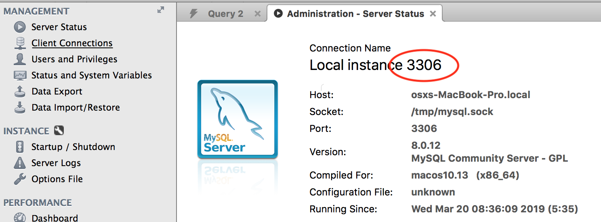
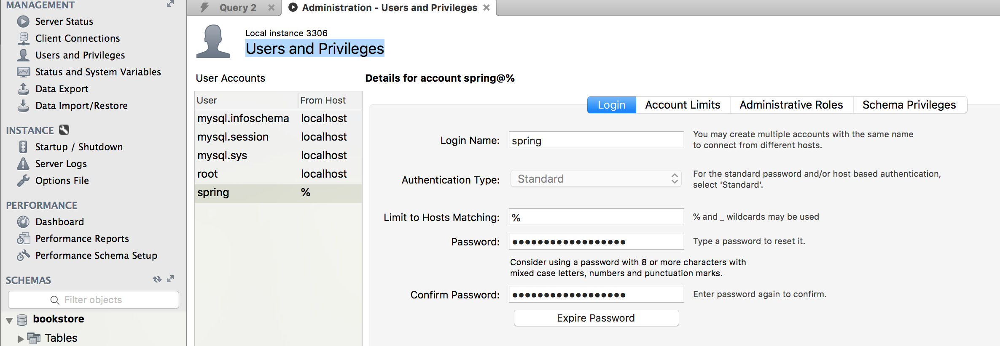
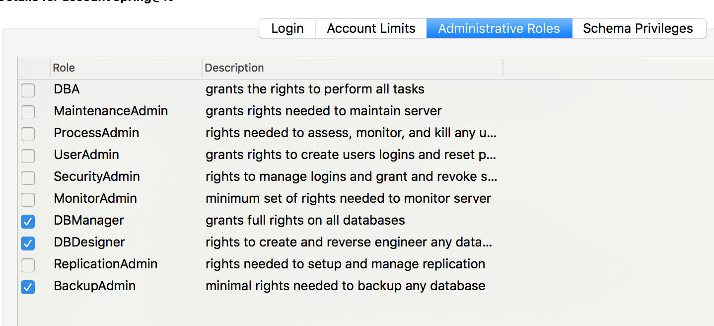
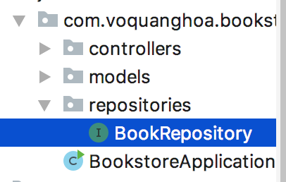
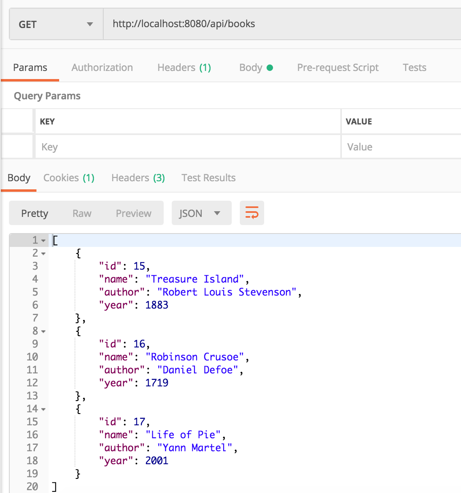

# Database phần I

## 1. Cấu hình MySQL

Để kết nối với cơ sở dữ liệu MySQL từ Spring Boot, đảm bảo rằng MySQL đã được cài đặt và hoạt động bình thường.

Khởi động MySQL Workbench và kết nối vào local database. Sau đó mở phần server status



Ở đây MySQL đang hoạt động ở cổng 3306.

Sau đó vào phần Users and Privileges, tạo một user mới có tên là spring và mật khẩu có thể là spring123



Trong mục Administrative Roles tick chọn như dưới



Xong tất cả, bấm Apply.

## 2. Tạo Database

Trong MySQL Workbench, ở phần Schema, chọn Create Schema


Nhập tên database (schema) là bookstore rồi apply.

## 3. Kết nối MySQL từ Spring

### Cấu hình dự án

Mở file application.properties và thay đổi nội dung thành

```property
spring.jpa.hibernate.ddl-auto=update
spring.datasource.url=jdbc:mysql://localhost:<port>/bookstore
spring.datasource.username=spring
spring.datasource.password=spring123
```

Thêm dependency vào file `pom.xml` và hoàn tất import

```xml
<dependency>
	<groupId>org.springframework.boot</groupId>
	<artifactId>spring-boot-starter-data-jpa</artifactId>
</dependency>

<dependency>
	<groupId>mysql</groupId>
	<artifactId>mysql-connector-java</artifactId>
</dependency>
```
### Cập nhật model, thêm repository và tích hợp repository vào controller

Chỉnh sửa file `Book.java` thành

```java
import lombok.Data;

import javax.persistence.Entity;
import javax.persistence.GeneratedValue;
import javax.persistence.GenerationType;
import javax.persistence.Id;

@Data
@Entity
public class Book {

    @Id
    @GeneratedValue(strategy= GenerationType.AUTO)
    private int id;

    private String name;

    private String author;

    private int year;
}
```

Thêm interface `BookRepository` vào package `repositories`



Nội dung

```java
import com.voquanghoa.bookstore.models.Book;
import org.springframework.data.repository.CrudRepository;

public interface BookRepository extends CrudRepository<Book, Integer> {
}
```

Cập nhật Controller để tích hợp với repository 

```java

import com.voquanghoa.bookstore.models.Book;
import com.voquanghoa.bookstore.repositories.BookRepository;
import org.springframework.beans.factory.annotation.Autowired;
import org.springframework.web.bind.annotation.*;

import java.util.Optional;

@RestController
@RequestMapping("/api/books")
public class BookController {

    @Autowired
    private BookRepository bookRepository;

    @GetMapping("/{id}")
    Optional<Book> get(@PathVariable int id){
        return bookRepository.findById(id);
    }

    @GetMapping
    Iterable<Book> get(){
        return bookRepository.findAll();
    }

    @DeleteMapping("/{id}")
    void delete(@PathVariable int id){
        bookRepository.deleteById(id);
    }

    @PostMapping()
    void post(@RequestBody Book book){
        book.setId(0);
        bookRepository.save(book);
    }

    @PutMapping()
    void put(@RequestBody Book book){
        bookRepository.save(book);
    }
}
```

### Thử nghiệm

Khởi chạy dịch vụ web, thực hiện các request bằng postman, dữ liệu sẽ được lưu thực sự như thế này




### Thêm thao tác vào repository

Trên đây, ta mới chỉ sử dụng các method có sẵn từ interface `CrudRepository` là `save`, `findById`, `deleteById`, `findAll`. Ngoài ra ta cũng có thể thêm các phương thức tùy biến khác:

Ví dụ: Tìm kiếm sách với tên

```java
import com.voquanghoa.bookstore.models.Book;
import org.springframework.data.repository.CrudRepository;

public interface BookRepository extends CrudRepository<Book, Integer> {
    Iterable<Book> findByNameContaining(String pattern);
}

```

Controller

```java
    @GetMapping("/find")
    Iterable<Book> find(@RequestParam String name){
        return bookRepository.findByNameContaining(name);
    }
```

Kết quả


## 4. Câu hỏi và bài tập

1. Chỉ thị @Id và @GeneratedValue có ý nghĩa gì trong ví dụ trên
2. Trong phần `extends CrudRepository<Book, Integer>` thì `Integer` là gì, tại sao ở đây là `Integer`
3. CrudRepository và BookRepository là gì và nó có ý nghĩa gì trong ứng dụng
4. Thực hiện implement Model, Repository và Controller cho Category, Publisher
5. Thêm thuộc tính `price` và thêm vào Repository phương thức tìm kiếm sách có giá trong phạm vi `min` đến `max`
6. Thay đổi router `/find` để nhận vào một query `q` có thể tìm kiếm book có `name` hoặc `author` chứa query `q`
7. Thay đổi router GET "" để nhận vào các optional parametter String `q`, String `order`, String orderType="ASC", thay đổi response dựa theo params.