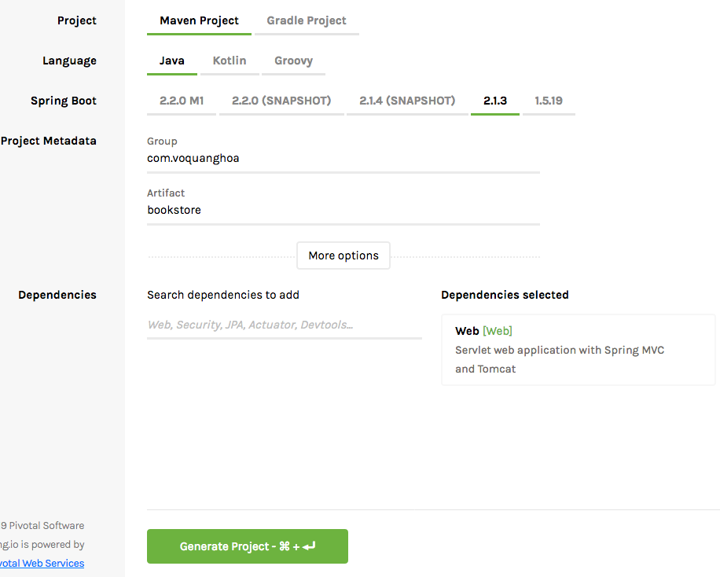
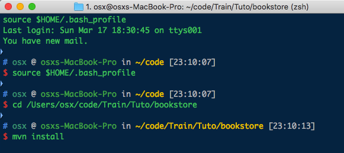
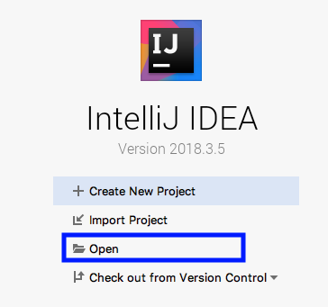
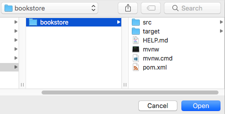

## 1. Khởi tạo project

Vào trang https://start.spring.io/, điền cấu hình tương tự như dưới đây và bấm `Generate Project`

Download file zip về máy, giải nén vào thư mục an toàn, ví dụ ở đây mình giải nén vào thư mục ~/code/Train/Tuto/bookstore

Mở command line tại thư mục giải nén và chạy lệnh `mvn install`

Nếu mọi thứ sẵn sàng, kết quả sẽ là 

Sau đó chạy lệnh `mvn spring-boot:run`

Chú ý thông báo `Tomcat started on port(s): 8080 (http) with context path ''`, mở trình duyệt và nhập http://localhost:8080/ sẽ nhận được 

Như vậy là ok. Tắt command line.

## 2. Mở dự án với IntelliJ IDEA

Mở IntelliJ IDEA và chọn Open

Chọn đường dẫn tới dự án

Sau khi dự án được mở, các tiến trình IDE khởi chạy hoàn tất, mở file Application và chọn `Run <File>.main()` từ menu chuột phải

Nếu mọi thứ suôn sẽ, web service cũng được khởi chạy tương đương với lệnh `mvn spring-boot:run`

Giờ đây, IntelliJ cũng tự thiết lập cấu hình chạy dự án, trên thanh công cụ, ta có thể bấm nút Start để khởi chạy, Stop để tắt dịch vụ....

Như vậy là mọi thứ đã sẵn sàng để tiếp tục những bài tiếp theo.