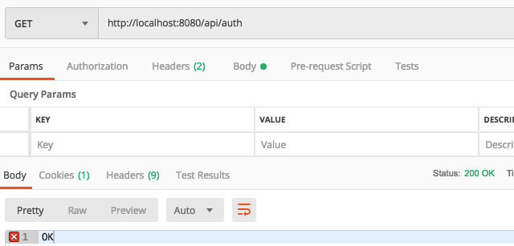
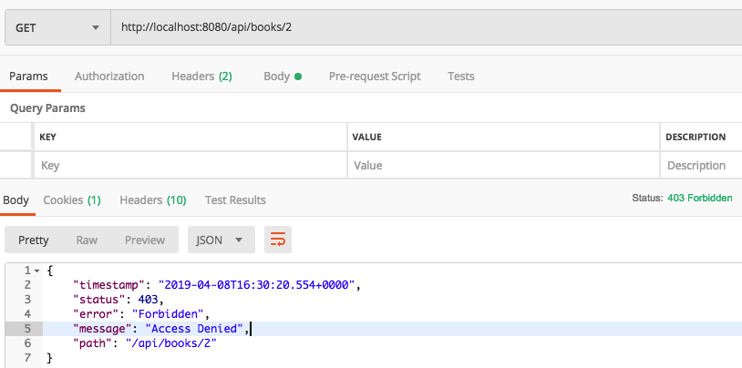

# Security phần 2

Xem:

- [Phần 1](Security.md)

## Quy định router với Security

Tạo class `AuthenticationController` với nội dung

```java
import org.springframework.web.bind.annotation.GetMapping;
import org.springframework.web.bind.annotation.RequestMapping;
import org.springframework.web.bind.annotation.RestController;

@RestController
@RequestMapping("/api/auth")
public class AuthenticationController {

    @GetMapping
    public String test(){
        return "OK";
    }
}
```

Tạo class `WebSecurityConfig` trong package `configurations` với nội dung như sau:

```java
import org.springframework.context.annotation.Configuration;
import org.springframework.security.config.annotation.web.builders.HttpSecurity;
import org.springframework.security.config.annotation.web.configuration.EnableWebSecurity;
import org.springframework.security.config.annotation.web.configuration.WebSecurityConfigurerAdapter;

@Configuration
@EnableWebSecurity
public class WebSecurityConfig extends WebSecurityConfigurerAdapter {

    @Override
    protected void configure(HttpSecurity http) throws Exception {
        http.cors().and().csrf().disable().
                authorizeRequests()
                .antMatchers("/api/auth").permitAll()
                .anyRequest()
                .authenticated();
    }
}
```

Ở đây, ta tạo một router `/api/auth` và quy định cho phép access tự do trong khi toàn bộ các request khác sẽ cần phải đăng nhập.

Kết quả

Có thể access router `/api/auth`



Với router còn lại thì sẽ bị lỗi 403

