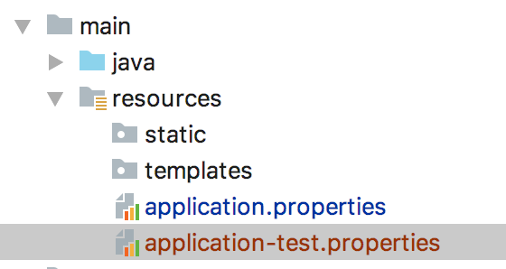
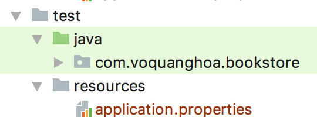

# Testing

## 1. Khởi tạo database:

Mở MySqlWorkbench tạo một database mới tên là `bookstore-test`.

## 2. Tạo profile test 

Copy file `application.properties` thành `application-test.properties`



Sửa 
```
spring.jpa.hibernate.ddl-auto=update
spring.datasource.url=jdbc:mysql://localhost:3306/bookstore
```

thành

```
spring.jpa.hibernate.ddl-auto=create
spring.datasource.url=jdbc:mysql://localhost:3306/bookstore-test
```

Để lúc chạy unit test, ứng dụng sẽ chạy với profile `test`, ta tạo file `application.properties` trong thư mục `test/resources` với nội dung



## 3. Sửa lỗi với Java 1.8

Từ IntelliJ, vào `Help` Chọn `Edit Custom Properties`, bấm `Create` nếu IntelliJ yêu cầu tạo file.

Thêm dòng này vào cuối file `idea.properties` đã được mở (nếu chưa có)

```
idea.no.launcher=true
```

Khởi động lại IntelliJ bằng cách vào `File` chọn `Invalidate and Restart` rồi xác nhận `Invalidate and Restart`

Done!

## 4. Loại bỏ một số components khỏi chế độ testing

Ta có class `DataSeedingListener` dùng để khởi tạo dữ liệu, ta cần phải bỏ nó đi ở chế độ test bằng cách thêm

```
@Profile({"!test"})
```

Thành

```java
@Component
@Configuration
@Profile({"!test"})
public class DataSeedingListener implements ApplicationListener<ContextRefreshedEvent> {

    @Autowired
    private UserRepository userRepository;

    @Autowired
    private RoleRepository roleRepository;
    ........
```

## 5. Test cấu hình

Trong class `BookstoreApplicationTests` (hoặc tên tương tự) đã có sẵn, ta sửa nó để được

```java
import org.junit.Test;
import org.junit.runner.RunWith;
import org.springframework.beans.factory.annotation.Value;
import org.springframework.boot.test.context.SpringBootTest;
import org.springframework.test.context.junit4.SpringRunner;

import static org.junit.Assert.assertEquals;

@RunWith(SpringRunner.class)
@SpringBootTest
public class BookstoreApplicationTests {

	@Value("${spring.datasource.url}")
	private String dataSourceUrl;

	@Test
	public void contextLoads() {
	}

	@Test
	public void test_dataSourceUrl(){
		assertEquals(dataSourceUrl, "jdbc:mysql://localhost:3306/bookstore-test");
	}
}
```

Chạy test


## 6. Test repository

Giả sử ta có repository như thế này

```java
import com.voquanghoa.bookstore.models.User;
import org.springframework.data.jpa.repository.JpaRepository;
import org.springframework.stereotype.Service;

@Service
public interface UserRepository extends JpaRepository<User, Integer>{

    User findByUsername(String username);
}
```

Ta tạo UserRepositoryTest với nội dung

```java
import com.voquanghoa.bookstore.models.User;
import com.voquanghoa.bookstore.repositories.UserRepository;
import org.junit.Test;
import org.junit.runner.RunWith;
import org.springframework.beans.factory.annotation.Autowired;
import org.springframework.boot.test.context.SpringBootTest;
import org.springframework.test.context.junit4.SpringRunner;

import static org.junit.Assert.assertNotNull;
import static org.junit.Assert.assertNull;

@RunWith(SpringRunner.class)
@SpringBootTest
public class UserRepositoryTest {

    @Autowired
    private UserRepository userRepository;

    @Test
    public void test_findByUsername(){
        userRepository.save(new User("abc", "First name", "Last name", "123"));

        assertNotNull(userRepository.findByUsername("abc"));
        assertNull(userRepository.findByUsername("ffff"));
    }
}
```

## 7. Test API

Tạm vô hiệu hóa security của api `api/books`
```java
@Override
protected void configure(HttpSecurity http) throws Exception {
    http.cors().and().csrf().disable().
            authorizeRequests()
            .antMatchers("/api/auth").permitAll()
            .antMatchers("/api/books", "/api/books/*").permitAll()
            .anyRequest()
            .authenticated();

    http
            .addFilterBefore(authenticationTokenFilterBean(), UsernamePasswordAuthenticationFilter.class);

}
```
POM.xml

```xml
<dependency>
    <groupId>com.google.code.gson</groupId>
    <artifactId>gson</artifactId>
    <version>2.2.2</version>
    <scope>test</scope>
</dependency>
<dependency>
    <groupId>org.assertj</groupId>
    <artifactId>assertj-core</artifactId>
</dependency>
```
Unit test

```java
package com.voquanghoa.bookstore;

import com.google.gson.Gson;
import com.voquanghoa.bookstore.models.Book;
import com.voquanghoa.bookstore.repositories.BookRepository;
import org.hamcrest.Matchers;
import org.junit.After;
import org.junit.Before;
import org.junit.Test;
import org.junit.runner.RunWith;
import org.springframework.beans.factory.annotation.Autowired;
import org.springframework.boot.autoconfigure.EnableAutoConfiguration;
import org.springframework.boot.test.autoconfigure.web.servlet.AutoConfigureMockMvc;
import org.springframework.boot.test.context.SpringBootTest;
import org.springframework.http.MediaType;
import org.springframework.test.context.junit4.SpringRunner;
import org.springframework.test.context.web.WebAppConfiguration;
import org.springframework.test.web.servlet.MockMvc;

import java.util.ArrayList;

import static org.junit.Assert.*;
import static org.springframework.test.web.servlet.request.MockMvcRequestBuilders.*;
import static org.springframework.test.web.servlet.result.MockMvcResultHandlers.print;
import static org.springframework.test.web.servlet.result.MockMvcResultMatchers.*;

@RunWith(SpringRunner.class)
@SpringBootTest
@AutoConfigureMockMvc
@WebAppConfiguration
@EnableAutoConfiguration(exclude = {org.springframework.boot.autoconfigure.gson.GsonAutoConfiguration.class})
public class BookControllerTest {

    @Autowired
    private BookRepository bookRepository;

    private Book book1;
    private Book book2;

    @Autowired
    private MockMvc mockMvc;

    @Before
    public void init(){
        book1 = bookRepository.save(new Book(1, "English"));
        book2 = bookRepository.save(new Book(2, "Mathematics"));
    }

    @After
    public void destroy(){
        bookRepository.deleteAll();
    }

    @Test
    public void test_getAllBook() throws Exception{
        mockMvc.perform(get("/api/books"))
                .andDo(print())
                .andExpect(status().isOk())
                .andExpect(content().contentTypeCompatibleWith(MediaType.APPLICATION_JSON))
                .andExpect(jsonPath("$", Matchers.hasSize(2)))
                .andExpect(jsonPath("$[0].id", Matchers.equalTo(book1.getId())))
                .andExpect(jsonPath("$[0].name", Matchers.equalTo("English")))
                .andExpect(jsonPath("$[1].id", Matchers.equalTo(book2.getId())))
                .andExpect(jsonPath("$[1].name", Matchers.equalTo("Mathematics")));
    }

    @Test
    public void test_getBook_Found() throws Exception{
        mockMvc.perform(get("/api/books/" + book2.getId()))
                .andDo(print())
                .andExpect(status().isOk())
                .andExpect(content().contentTypeCompatibleWith(MediaType.APPLICATION_JSON))
                .andExpect(jsonPath("$.id", Matchers.equalTo(book2.getId())))
                .andExpect(jsonPath("$.name", Matchers.equalTo(book2.getName())));
    }

    @Test
    public void test_getBook_NotFound() throws Exception{
        mockMvc.perform(get("/api/books/" + (book2.getId() + book1.getId())))
                .andDo(print())
                .andExpect(status().isNotFound());
    }

    @Test
    public void test_deleteBook_NotFound() throws Exception{
        mockMvc.perform(delete("/api/books/" + (book2.getId() + book1.getId())))
                .andExpect(status().isNotFound());
    }

    @Test
    public void test_deleteBook_Found() throws Exception{
        mockMvc.perform(delete("/api/books/" + book1.getId()))
                .andExpect(status().isOk());

        assertFalse(bookRepository.findById( book1.getId()).isPresent());
    }

    @Test
    public void test_put_Found() throws Exception{

        Gson gson = new Gson();
        String json = gson.toJson(new Book(book2.getId(), "Math"));

        mockMvc.perform(put("/api/books")
                .contentType(MediaType.APPLICATION_JSON).content(json))
                .andExpect(status().isOk());

        assertTrue(bookRepository.findById(book2.getId()).isPresent());
        assertEquals(bookRepository.findById(book2.getId()).get().getName(), "Math");
    }

    @Test
    public void test_post_ok() throws Exception{

        Gson gson = new Gson();
        String json = gson.toJson(new Book(0, "Geometry"));

        mockMvc.perform(put("/api/books")
                .contentType(MediaType.APPLICATION_JSON).content(json))
                .andExpect(status().isOk());


        ArrayList<Book> books = (ArrayList<Book>) bookRepository.findAll();
        Book book = books.get(books.size()-1);

        assertEquals (book.getName(), "Geometry");
    }
}
```